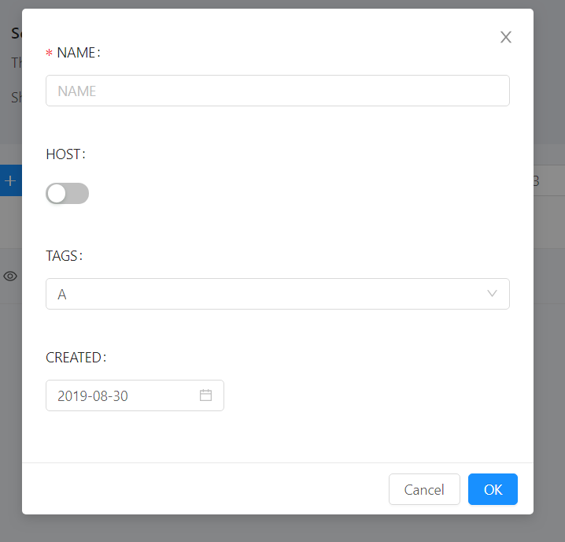

# React-AntDesign-boilerplate

## This is a boilerplate for custom react component that have the following features
- (1) Basic CRUD operation with Ant Design Table and custom pop modal edit form(Including UI and callback events).
- (2) Allow user to bind custom UI/Style 
- (3) Model Validate
- (4) UI Generator with custom Tags
- (5) Easy to use with inherit

## Requirement and Dependencies
- A. Reactjs
- B. React-dom
- C. Ant Design
- D. Axios
- E. Webpack

## How to run the project
Step1: Clone this project

Step2:
```
npm install
```

Step3:
```
npm run dev
```

Step4: Enjoy your development!

## Usage
### Import "MasterForm" and Inherit from "MasterForm"
```js
import React from 'react';
import { Tag, Button, Icon, Card, Input, Row, Col } from 'antd';
import * as moment from 'moment';
import MasterForm from 'components/DetailForm/MasterForm';
```
### Declare the columns in constuctor

```js
export default class Service extends MasterForm { 
    constructor(props) {
        super(props);
        this.columns = [
          {
              title: '',
              key:'id',
              dataIndex: 'id',
              render: (text, record) =><Icon type="eye" onClick={()=> this.readRow(record)}/>
          },
          {
            title: 'NAME',
            dataIndex: 'name',
            key: 'name',
            validate : {required : true , max : 20},
            render: (text, record) => <a onClick={()=> this.updateRow(record)}>{text}</a>,
          },
          {
            title: 'HOST',
            dataIndex: 'host',
            key: 'host',
            type : 'switch',
            render: (text, record) => <div>{record["host"]!==undefined ? record["host"].toString() : ""}</div>
          },
          {
            title: 'TAGS',
            dataIndex: 'tags',
            key: 'tags',
            dataset : [{value:"A", key:"10000"},{value:"B", key:"20000"}],
            type : "select",
            default : "A"
          },
          {
            title: 'CREATED',
            dataIndex: 'created_at',
            key: 'created_at',
            type : "date",
            default: moment(Date.now()),
            render: (text , record, index) => <div key={"Created-"+ index}>{moment(record.created_at).format('YYYY/MM/DD HH:mm:ss')}</div>
          },
          {
            title: '',
            key: 'action',
            render: (text, record) => (
              <span>
                  <Tag color="red" onClick = {()=>this.deleteRow(record)}>
                  <Icon type="delete"/> DELETE
                  </Tag>
              </span>
            ),
          }
        ];
    }
}
```

### Include the Table(AntDesign) to html
Put the renderUI() function to wherever you want.
```js
render() {
    return (
      <div>
        {this.renderUI()}
      </div>
    );
``` 

### How to open the edit-form with Create/Edit/ReadOnly Mode
- Create Mode
#### Call the basic function in MasterForm named <font color="red">this.addRow</font>
```js
render() {
    const { Search } = Input;
    return (
      <div>
        <br/>
        <div>
          <Row>
            <Col span={16}>
              <Button type="primary" icon='plus' onClick={this.addRow}>ADD NEW SERVICE</Button>
            </Col>
            <Col span={8}>
              <Search placeholder="Search NAME" onSearch={value => this.queryData(value)} enterButton />      
            </Col>
          </Row>
        </div>
        {this.renderUI()}
      </div>
    );
```


- Edit Mode
#### Call the basic function in MasterForm named <font color=red>this.updateRow when you declare the column schema in constructor</font>
```js
this.columns = [
          ...,
          {
            title: 'NAME',
            dataIndex: 'name',
            key: 'name',
            validate : {required : true , max : 20},
            render: (text, record) => <a onClick={()=> this.updateRow(record)}>{text}</a>,
          },
```


- ReadOnly Mode
#### Call the basic function in MasterForm named <font color=red>this.readRow when you declare the column schema in constructor</font>
```js
this.columns = [
          {
              title: '',
              key:'id',
              dataIndex: 'id',
              render: (text, record) =><Icon type="eye" onClick={()=> this.readRow(record)}/>
          },
```


## Attributes
The description of the Attributes.

|Attribute|Description|Remark|
|:-|:-|:-|
|title|The title of Table or edit-form item|
|key|The column name of model| id is recommand to be required|
|type|The display type of edit-form item/model|string, select, date, switch, checkbox(default to be "string") |
|dataset|The dataset of input type "select". The input type would be "select" automatically when dataset been used| [{value:"A", key:"10000"},{value:"B", key:"20000"}]
|default|Default value|
|validate|Model validation rules|e.g. required, max, min
|render|The render style of Table|type "date" default to be ISO String
|editRender|The render style of edit form item|
|hidden|Ignore the column in Table and Edit form|true/false

### #Samples for each Tags
#### Bind the select item with dataset
```js
this.columns = [
          ...,
          {
            ...,
            key: 'tags',
            dataset : [{value:"A", key:"10000"},{value:"B", key:"20000"}],
            type : "select",
          },
```


#### Model Validation
```js
this.columns = [
          ...,
          {
            ...,
            key: 'name',
            validate : {required : true , max : 20}
          },
```
		  

#### Custom edit-form item style
```js
this.columns = [
          ...,
          {
            ...,
            key: 'tags',
            editRender : (record, handleInputEvent, customAttr) =>{
              return(
              <Radio.Group onChange={handleInputEvent} {...customAttr}>
                  <Radio.Button value={"A"}>10000</Radio.Button>
                  <Radio.Button value={"B"}>20000</Radio.Button>
              </Radio.Group>
              )
            }
          },
```
P.s Remember to bind the onChange event "handleInputEvent" for model validation.
	
	  
## Callback event to do CRUD operation with RESTful API

### Query
Get the data from API or local and update the state.data with it.
```js
queryData = (value) =>{
    //Call Query(Http Get) API 
    //let dt = data.filter(r=> r.name.indexOf(value) > -1);
    this.setState({data : dt});
}
```

### Create and Update
Override the function name "handleOK". Besides, you can import confirm window if you want. 
```js
handleOK = (row) =>{
    if(this.state.status === "add"){
        //Call Add(http POST) API with model row
    }
    else{ //Update
        //Call Update(http PUT) API with model row
    }
	//refresh data
}

```

### Delete
Override the function name "deleteRow". Besides, you can import confirm window if you want. 
```js
deleteRow = (row) =>{
    //Call Delete(http DELETE) API with model row
    //refresh data
}
```


